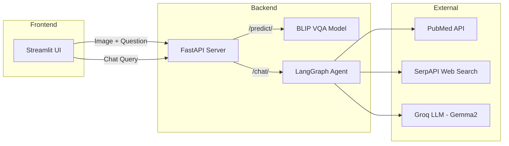

<div align="center">

# 🧠 NeuroVision — Medical Visual Question Answering

**An end-to-end VQA system for medical brain imaging, powered by BLIP, LangGraph, and FastAPI.**

[](https://huggingface.co/Salesforce/blip-vqa-base)
[](https://pytorch.org/)
[](https://fastapi.tiangolo.com/)
[](https://github.com/langchain-ai/langgraph)
[](https://dvc.org/)
[](https://www.docker.com/)
[](https://mlflow.org/)


</div>

---

## 🔍 Overview

NeuroVision is a Visual Question Answering (VQA) system designed for **medical brain imaging** (CT & MRI scans). It fine-tunes the [BLIP](https://huggingface.co/Salesforce/blip-vqa-base) model on the [VQA-RAD](https://huggingface.co/datasets/flaviagiammarino/vqa-rad) dataset and serves predictions through a high-performance **FastAPI** backend, complemented by a **LangGraph-powered AI agent** that can search PubMed and the web for medical context.

### ✨ Key Features

| Feature | Description |
|---|---|
| 🖼️ **Image-based VQA** | Upload a brain scan and ask natural-language questions about it |
| 🤖 **Medical AI Agent** | LangGraph ReAct agent with PubMed + Web search tools |
| ⚡ **FastAPI Backend** | Async API with automatic OpenAPI docs at `/docs` |
| 📊 **MLflow Tracking** | Full experiment tracking with metrics, params, and model artifacts |
| 🔄 **DVC Pipeline** | Reproducible data processing → training → evaluation pipeline |
| 🐳 **Docker Ready** | One-command containerized deployment |
| 🎨 **Streamlit UI** | Interactive frontend for visual question answering |

---

## 📋 Table of Contents

- [Overview](#-overview)
- [Architecture](#-architecture)
- [Quick Start](#-quick-start)
- [Installation](#-installation)
- [Configuration](#️-configuration)
- [API Reference](#-api-reference)
- [LangGraph Agent](#-langgraph-agent)
- [Training Pipeline](#-training-pipeline)
- [Docker Deployment](#-docker-deployment)
- [Project Structure](#-project-structure)
- [Results & Future Work](#-results--future-work)

---

## 🏗 Architecture



---

## 🚀 Quick Start

Get the entire project running with **two commands**:

```bash
# 1. Clone the repository
git clone https://github.com/Aryan-coder-student/NeuroVision-BHPC-VQA.git
cd NeuroVision-BHPC-VQA

# 2. Run the automated setup script — this does EVERYTHING for you
bash setup.sh
```

That's it. The `setup.sh` script handles the complete environment bootstrap:

| Step | What it does |
|---|---|
| 1️⃣ | Installs [uv](https://astral.sh/uv) (ultra-fast Python package manager) if not already present |
| 2️⃣ | Creates a `.venv` virtual environment |
| 3️⃣ | Activates the virtual environment (cross-platform: Windows & Linux/Mac) |
| 4️⃣ | Installs all dependencies from `requirements.txt` via `uv pip install` |
| 5️⃣ | Downloads the [VQA-RAD dataset](https://huggingface.co/datasets/flaviagiammarino/vqa-rad) from Hugging Face into `data/bronze/` |

### After Setup

```bash
# Add your API keys (required for the medical chatbot)
echo "SERPAPI_API_KEY=your_key_here" > Deployment/.env
echo "GROQ_API_KEY=your_key_here" >> Deployment/.env

# Activate the virtual environment (if not already active)
# Windows
.venv\Scripts\activate
# Linux / macOS
source .venv/bin/activate

# Launch the API server
python Deployment/app.py
```

The API will be live at **`http://localhost:5000`** with interactive Swagger docs at **`http://localhost:5000/docs`**.

---

## 📦 Installation

### Prerequisites

| Requirement | Version |
|---|---|
| Python | 3.10+ |
| CUDA (optional) | 11.8+ (for GPU acceleration) |
| Git | 2.30+ |
| [uv](https://astral.sh/uv) | Latest (auto-installed by `setup.sh`) |

### Manual Setup

```bash
# 1. Create and activate virtual environment
python -m venv .venv
# Windows
.venv\Scripts\activate
# Linux / macOS
source .venv/bin/activate

# 2. Install dependencies
pip install -r requirements.txt

# 3. Download the VQA-RAD dataset
python -c "
from datasets import load_dataset
dataset = load_dataset('flaviagiammarino/vqa-rad')
dataset.save_to_disk('data/bronze/')
print('Dataset downloaded to data/bronze/')
"
```

### Environment Variables

Create a `Deployment/.env` file:

```env
SERPAPI_API_KEY=your_serpapi_key        # Required for Medical Web Search tool
GROQ_API_KEY=your_groq_api_key         # Required for the LLM (Gemma2-9b-it)
```

| Variable | Purpose | Get it from |
|---|---|---|
| `SERPAPI_API_KEY` | Powers the Medical Web Search tool | [serpapi.com](https://serpapi.com/) |
| `GROQ_API_KEY` | Powers the Gemma2 LLM via Groq | [console.groq.com](https://console.groq.com/) |

---

## ⚙️ Configuration

All project configuration is centralized in two YAML files:

**`config.yaml`** — Model paths and data locations:
```yaml
finetune_model:
  best: models/best-saved-model
  last: models/last-saved-model
  orignal_model_id: Salesforce/blip-vqa-base
data_location:
  data: data/bronze/flaviagiammarino___vqa-rad
  train_processed_data: data/silver/train_dataset.pkl
  test_processed_data: data/silver/test_dataset.pkl
result: results
```

**`param.yaml`** — Training hyperparameters:
```yaml
params:
  batch_size: 8
  num_epochs: 50
  learning_rate: 5e-5
  weight_decay: 1e-4
  gradient_accumulation_steps: 4
  patience: 10
```

---

## 📡 API Reference

The FastAPI server exposes two endpoints. Full interactive documentation is auto-generated at **`/docs`** (Swagger UI) and **`/redoc`** (ReDoc).

### `POST /predict/` — Image Question Answering

Upload a medical image and ask a question about it.

**Request** (multipart form-data):
```bash
curl -X POST "http://localhost:5000/predict/" \
  -F "file=@brain_scan.jpg" \
  -F "question=Is there a tumor visible?"
```

**Response:**
```json
{
  "answer": "yes"
}
```

### `POST /chat/` — Medical AI Chatbot

Ask medical questions powered by the LangGraph agent.

**Request** (JSON):
```bash
curl -X POST "http://localhost:5000/chat/" \
  -H "Content-Type: application/json" \
  -d '{"query": "What are the latest treatment options for glioblastoma?"}'
```

**Response:**
```json
{
  "response": "Glioblastoma treatment typically involves a multimodal approach including surgical resection, radiation therapy (usually 60 Gy in 30 fractions), and concurrent temozolomide chemotherapy..."
}
```

### Python Client Example

```python
import requests

# Image VQA
files = {"file": open("brain_scan.jpg", "rb")}
data = {"question": "What abnormality is present?"}
response = requests.post("http://localhost:5000/predict/", files=files, data=data)
print(response.json())

# Medical Chat
payload = {"query": "Explain the differences between CT and MRI for brain imaging"}
response = requests.post("http://localhost:5000/chat/", json=payload)
print(response.json())
```

---

## 🤖 LangGraph Agent

The medical chatbot uses a modern **LangGraph ReAct agent** architecture — a stateful, graph-based agent that reasons step-by-step and calls tools as needed.

### Architecture

| Component | Technology | Purpose |
|---|---|---|
| **LLM** | Groq Gemma2-9b-it | Fast inference for reasoning and response generation |
| **Agent Framework** | LangGraph `create_react_agent` | Graph-based ReAct loop with tool calling |
| **Memory** | `MemorySaver` checkpointer | Persists conversation history across requests |
| **Web Search** | SerpAPI | Real-time medical web search |
| **Literature Search** | PubMed API | Peer-reviewed research paper retrieval |

### How It Works

```
User Query → LangGraph Agent → Reason → Select Tool(s) → Execute → Synthesize → Response
                  ↑                                                      |
                  └──────── Memory (MemorySaver) ←───────────────────────┘
```

1. The agent receives the user query along with conversation history
2. The LLM reasons about which tools to invoke (or responds directly)
3. Tools are called (PubMed, web search) and results are collected
4. The LLM synthesizes a comprehensive answer from tool outputs
5. Conversation state is persisted via the `MemorySaver` checkpointer

---

## 🔬 Training Pipeline

The full training pipeline is managed by **DVC** for reproducibility and **MLflow** for experiment tracking.

### Pipeline Stages

```
data/bronze/ ──→ preprocess ──→ data/silver/ ──→ train ──→ models/ ──→ evaluate ──→ results/
```

| Stage | Script | Input | Output |
|---|---|---|---|
| **Preprocess** | `src/preprocess_data.py` | Raw VQA-RAD dataset | Tokenized pickle files |
| **Train** | `src/train.py` | Processed data + params | Fine-tuned BLIP model |
| **Evaluate** | `src/evaluate.py` | Trained model + test data | BLEU scores & metrics |

### Training Features

- 🔥 **Mixed Precision Training** (FP16) for memory efficiency
- 📈 **Gradient Accumulation** (4 steps) to simulate larger batch sizes
- 🛑 **Early Stopping** with configurable patience
- 📊 **MLflow Tracking** for all metrics, params, and model artifacts
- 🔄 **Learning Rate Warmup** with linear decay scheduling
- ✂️ **Gradient Clipping** (max_norm=1.0) for training stability

### Run the Pipeline

```bash
# Execute all stages
dvc repro

# Run individual stages
dvc repro preprocess
dvc repro train
dvc repro evaluate

# Push data to remote storage
dvc push

# Pull data from remote storage
dvc pull
```

### View Experiment Tracking

```bash
mlflow ui
# Open http://localhost:5000 to view experiments
```

---

## 🐳 Docker Deployment

### Build and Run

```bash
# Build the image
docker build -t neurovision-vqa .

# Run the container
docker run -p 5000:5000 \
  -e SERPAPI_API_KEY=your_key \
  -e GROQ_API_KEY=your_key \
  neurovision-vqa
```

### Dockerfile

```dockerfile
FROM python:3.10
WORKDIR /app
COPY requirements.txt .
RUN pip install -r requirements.txt
COPY . .
EXPOSE 5000
CMD ["python", "Deployment/app.py"]
```

### Run with Streamlit UI

To run both the API and the Streamlit frontend simultaneously:

```bash
# Terminal 1 — API Server
python Deployment/app.py

# Terminal 2 — Streamlit UI
streamlit run Deployment/streamlit/main.py --server.port=8501
```

The Streamlit UI will be available at **`http://localhost:8501`**.

---

## 📁 Project Structure

```
NeuroVision-BHPC-VQA/
├── .dvc/                         # DVC configuration
├── .agents/                      # Agent workflows and skills
│   └── workflows/
│       └── git-push.md           # Git workflow for this project
├── data/
│   ├── bronze/                   # Raw VQA-RAD dataset (DVC-tracked)
│   └── silver/                   # Preprocessed tokenized data
├── Deployment/
│   ├── app.py                    # FastAPI application entry point
│   ├── test_api.py               # API integration tests
│   └── streamlit/
│       └── main.py               # Streamlit frontend
├── models/
│   ├── best-saved-model/         # Best checkpoint (by BLEU score)
│   └── last-saved-model/         # Latest checkpoint
├── src/
│   ├── model.py                  # BLIP model loading & configuration
│   ├── preprocess_data.py        # Dataset preprocessing pipeline
│   ├── train.py                  # Training loop with MLflow tracking
│   ├── evaluate.py               # BLEU score evaluation
│   └── trl_rlhf_train.py        # Experimental RLHF training script
├── results/                      # Evaluation outputs (JSON)
├── mlruns/                       # MLflow experiment data
├── config.yaml                   # Model & data path configuration
├── param.yaml                    # Training hyperparameters
├── dvc.yaml                      # DVC pipeline definition
├── dvc.lock                      # DVC pipeline lock file
├── Dockerfile                    # Container build configuration
├── requirements.txt              # Python dependencies
├── setup.sh                      # Automated environment setup script
└── README.md
```

---

## 📊 Results & Future Work

### Current Capabilities

- ✅ Fine-tuned BLIP model on VQA-RAD for medical image Q&A
- ✅ BLEU score evaluation with early stopping on best checkpoint
- ✅ Full experiment reproducibility via DVC + MLflow
- ✅ Production-ready async API with FastAPI
- ✅ Conversational medical AI agent with persistent memory

### 🔮 Roadmap

- [ ] Add QLoRA 4-bit quantization for efficient deployment on consumer hardware
- [ ] RLHF fine-tuning for improved answer quality
- [ ] Multi-modal RAG with medical image retrieval
- [ ] Expand to chest X-ray and pathology datasets
- [ ] Add image segmentation overlays for explainable predictions
- [ ] Multilingual VQA support
- [ ] Deployment to Hugging Face Spaces

---

## 📄 License

This project is for educational and research purposes.

---

<div align="center">

**NeuroVision** — Medical Visual Question Answering

Built with ❤️ using BLIP · FastAPI · LangGraph · PyTorch

</div>
